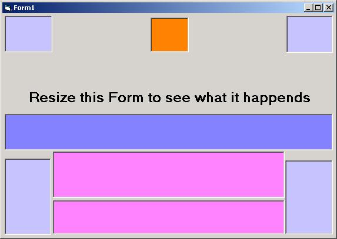



## clsResizeForm

### Description

The most easy way to resize controls al form_resize event. very simply implementation. only two class modules.
 
### More Info
 
If you use it, please, let me know by email.

             |
---                |---
**Submitted On**   |2003-02-24 18:02:02
**By**             |[Jeronimo Sencianes](https://github.com/Planet-Source-Code/PSCIndex/blob/master/ByAuthor/jeronimo-sencianes.md)
**Level**          |Intermediate
**User Rating**    |4.7 (14 globes from 3 users)
**Compatibility**  |VB 6\.0
**Category**       |[Miscellaneous](https://github.com/Planet-Source-Code/PSCIndex/blob/master/ByCategory/miscellaneous__1-1.md)
**World**          |[Visual Basic](https://github.com/Planet-Source-Code/PSCIndex/blob/master/ByWorld/visual-basic.md)
**Archive File**   |[clsResizeF1549922242003\.zip](https://github.com/Planet-Source-Code/jeronimo-sencianes-clsresizeform__1-43498/archive/master.zip)

